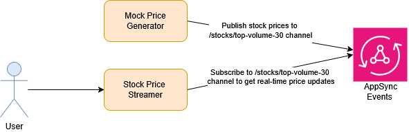

# stock-price-streaming

## Demo

## Architecture

## Tech stack
1. Amazon AppSync Events
2. AlpineJS
3. AG Grid
4. SAM

## How to deploy
1. Make sure Node.js, Docker and SAM CLI are installed.
2. Run `aws configure` to configure your access key and secret.
3. Run `sam build` to build the application.
4. Run `sam deploy --config-env <dev|prod>` to deploy the application to AWS.
5. Run `.\deploy_frontend.ps1` to deploy the frontend website.

## How to teardown
1. Run `sam delete --config-env <dev|prod>` to delete the SAM application.

## Developing on Local
1. Once the CloudFormation stack have been deployed, you can run `.\build_frontend.ps1` to build the frontend into `/dist` folder without being deployed to S3 and CloudFront. 
