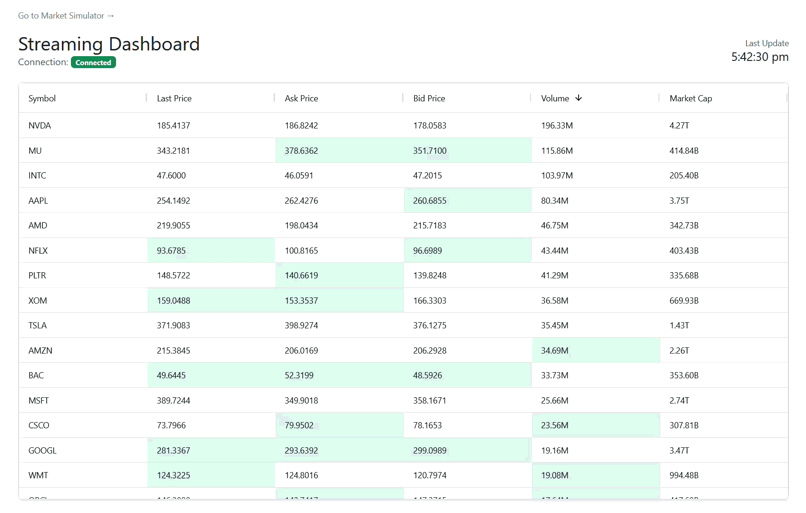

# 📈 Stock Price Streaming Dashboard

A high-performance, real-time stock price monitoring dashboard built with a modern serverless architecture. This project demonstrates how to leverage **AWS AppSync Events** for ultra-low latency data broadcasting to a reactive frontend.



## ✨ Key Features

- **Real-time Streaming**: Powered by AWS AppSync Events (Pub/Sub over WebSockets) for instantaneous data updates.
- **Interactive Data Grid**: Utilizes **AG Grid** for high-performance rendering, sorting, and live cell flashing.
- **Reactive UI**: Built with **AlpineJS** for a lightweight, maintainable, and responsive frontend experience.
- **Market Simulator**: Includes a built-in `market-simulator` utility to simulate market volatility and volume-based price movements.
- **Serverless & Scalable**: Fully hosted on AWS using S3 and CloudFront, ensuring global availability and high performance.

## 🏗️ Architecture

The application follows a clean, event-driven serverless architecture:

1.  **Ingestion**: A producer (like the included `market-simulator`) publishes stock updates to an **AppSync Channel**.
2.  **Broadcasting**: **AWS AppSync Events** broadcasts the payload to all connected clients over WebSockets.
3.  **Visualization**: The frontend receives the stream and updates the **AG Grid** in real-time, providing visual feedback (flashes) on price changes.


## 🛠️ Tech Stack

### Backend / Infrastructure
- **[AWS AppSync Events](https://aws.amazon.com/appsync/)**: Real-time Pub/Sub engine.
- **[AWS SAM](https://aws.amazon.com/serverless/sam/)**: Infrastructure as Code (IaC) for AWS resources.
- **[Amazon S3](https://aws.amazon.com/s3/) & [CloudFront](https://aws.amazon.com/cloudfront/)**: Static website hosting and global content delivery.

### Frontend
- **[Vite](https://vite.dev/)**: Blazing fast frontend build tool.
- **[AlpineJS](https://alpinejs.dev/)**: Lightweight JavaScript framework for reactive components.
- **[AG Grid](https://www.ag-grid.com/)**: Industry-leading data grid for real-time updates.
- **[Bootstrap 5](https://getbootstrap.com/)**: Modern styling and responsive layout.

## 🚀 Getting Started

### Prerequisites
- [Node.js](https://nodejs.org/) & [npm](https://www.npmjs.com/)
- [AWS CLI](https://aws.amazon.com/cli/) & [SAM CLI](https://docs.aws.amazon.com/serverless-repo/latest/devguide/serverless-sam-cli-install.html)
- Docker (required for `sam build`)

### Deployment
1. **Configure AWS**:
    ```bash
    aws configure
    ```
2. **Install npm Dependencies**
    ```bash
    npm install
    ```
3. **Build & Deploy Backend**:
    ```bash
    sam build
    sam deploy --config-env dev
    ```
4. **Deploy Frontend**:
    Execute the PowerShell script to build and sync the frontend to your S3 bucket:
    ```powershell
    .\deploy_frontend.ps1
    ```

### 💻 Local Development
1. **Configure Local Environment**:
    Create a `frontend/.env.local` file by copying the contents of `frontend/.env` and replacing the placeholders with your CloudFormation output values.
2. **Launch Development Server**:
    Start the Vite development server to preview the dashboard and market simulator locally:
    ```bash
    npm run frontend:dev
    ```
    The application will be available at:
    - **Dashboard**: `http://localhost:3000`
    - **Simulator**: `http://localhost:3000/market-simulator/`

## 🧹 Teardown
To remove all resources created by this project:
```bash
sam delete --config-env dev
```
